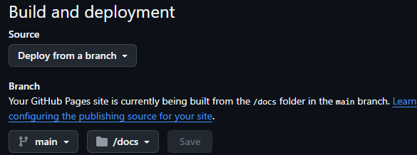

# siv3d-web-template

## 概要

Webブラウザで動作する Siv3D プログラミングを簡単に始めるテンプレートです。
このリポジトリを「Use This Template」して、Main.cpp を編集すればGitHub Actionsにより自動で　docs/　フォルダにブラウザで動作させるためのファイル一式が出来上がります。  
※GitHub Pages上でゲームを公開したい場合は、リポジトリはpublicにする必要があります。　　

## 簡単にゲームをGitHub Pagesで公開可能

このテンプレートの公開ページ  
<https://kunipoo.github.io/siv3d-web-template/>  

  
初回は設定が必要です  
1. Setting > Pages から Branch の設定を main /docs にして Saveを押してください。
2. ページの作成に１分ほどかかります。しばらくお待ちください。
3. ページの作成が完了すると、Setting > Pages の上部にある Visit site から作成されたWebページに移動可能です。

## ライセンス表記

- このリポジトリ自体は MIT No Attribution ライセンスにて配布します
  - このリポジトリに含まれるファイルは、OpenSiv3D フォルダ配下のファイルを除いて、ライセンス表記なしで自由に利用可能です
- Siv3D 本体のライセンスは <https://siv3d.jp/web/license/0.6.5/license.html> を参照してください
- emscripten によって出力された JavaScript ファイルは [MIT ライセンス](https://github.com/emscripten-core/emscripten/blob/main/LICENSE) に従います

## 謝辞

これは <https://github.com/nokotan/OpenSiv3DForWeb-VSCode> をベースに作成しました。

